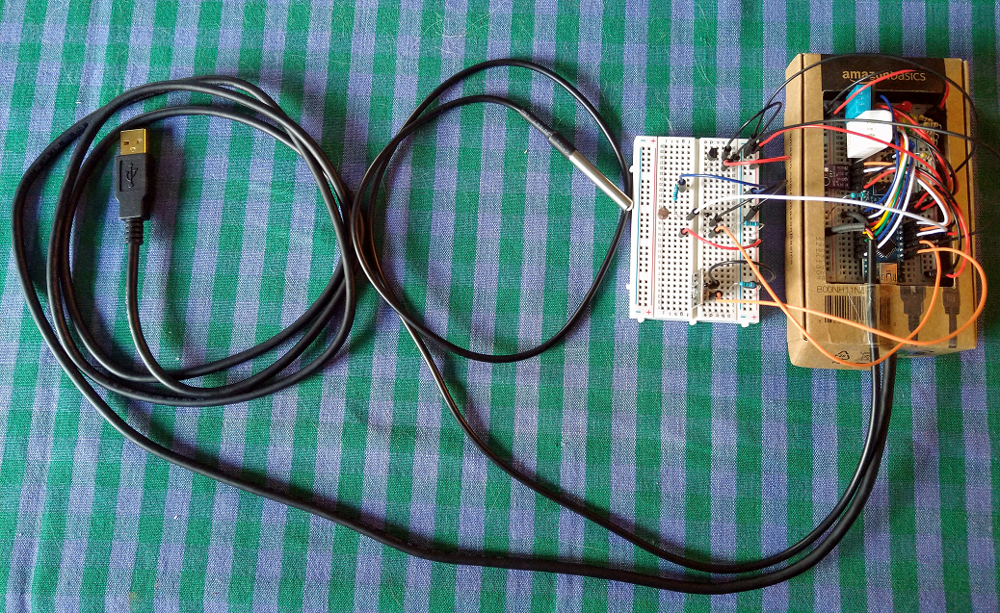
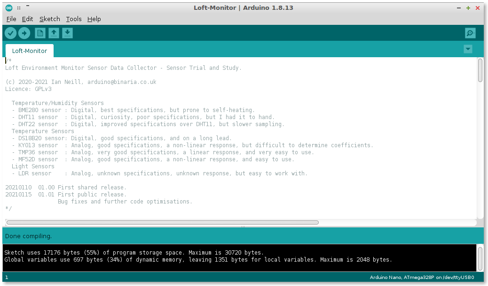
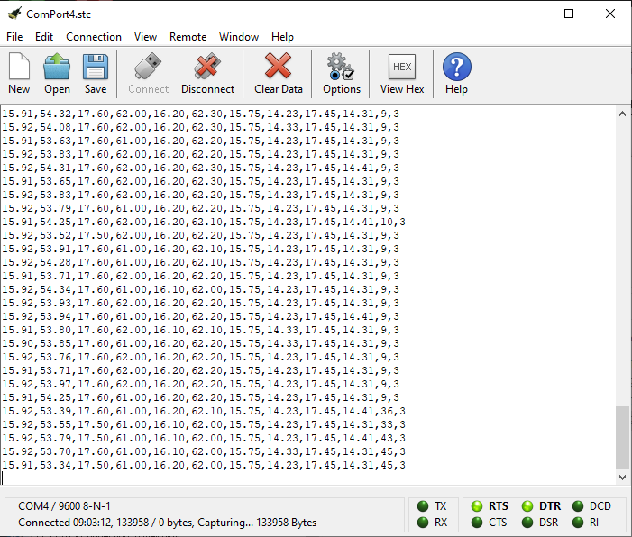

# Loft Environment Monitor Sensor Data Collector
> An Arduino Nano sketch (and libraries) to log temperature, humidity and light level data in my loft.

So, I have a Server, several NAS's, 2x UPS's and a lot of network kit in my loft. I also have a ton of other real junk, but that is not so interesting. Anyway, in the Winter, my loft (or my mini datacentre, as my friends call it) really does not have a temperature problem, but in the Summer it can get really hot, hot enough for me to power down all my kit just as a precaution.

Then, recently I discovered the Arduino, and eventually I have gained enough knowledge and experience to think about using an Arduino to monitor the environment in my loft. However, what temperature sensor would be the best, what temperature sensors were there, and how did they compare?

This project is built on an Arduino Nano (cheap, breadboard friendly) and has a total of 7x temperature sensors, 3x humdity sensors, and 1x light sensor (because I thought it might be useful too). It also has 5x LEDs that give a rough indication of what the temperature is.

**Temperature/Humidity Sensors**
- BME280 sensor: Digital, best specifications, prone to self-heating.
- DHT11 sensor: Digital, curiosity, poor specifications.
- DHT22 sensor: Digital, improved specifications over DHT11, but slower sampling.

**Temperature Sensors**
- DS18B20 sensor: Digital, good specifications, and on a long lead.
- KY013 sensor: Analog, good specifications, a non-linear response, but difficult to determine coefficients.
- TMP36 sensor: Analog, very good specifications, a linear response, and very easy to use.
- MF52D sensor: Analog, good specifications, a non-linear response, and easy to use.

**Light Sensors**
- LDR sensor: Analog, unknown specifications, unknown response, but easy to work with.

The various data readings are output as CSV at a rate of 4x readings per minute, but this, and almost everything, is configurable. This data is captured via USB by a handy Serial Console program called [CoolTerm](http://freeware.the-meiers.org/), and it is configured to timestamp each line as it is received and logged to disc. I have just left this running...

In realtime, I can look at the log to get the information, or just look at the LEDs to get a rough idea of what the temperature in my loft/datacentre is.

- Band 7: Red + White(F) = more than 55 deg C
- Band 6: Red + White = 45 --> 55 deg C
- Band 5: Red = 35 --> 45 deg C
- Band 4: Yellow = 25 --> 35 deg C
- Band 3: Green = 5 --> 25 deg C
- Band 2: Blue = -15 --> 5 deg C
- Band 1: Blue + White = -25 --> -15 deg C
- Band 0: Blue + White(F) = less than -25 deg C

In time, I will analyse the capured data (using LibreCalc), looking at the cycles, and comparing and contrasting the readings from the many sensors. I expect that I will settle on just 1 or 2 sensors and then harden the build. Eventually I will use some of the spare digital outputs to control fans and things like that.

An example "blob" of captured data can be studied [here](LoftMon20210111-1.csv).

I should also be able to automate some alerting. A simple python script running on the server could easily read the log, and send me an email if it spots whatever I want it to spot.



## Installation
1. Create an Arduino sketch folder ``Loft-Monitor``.
2. Copy ``Loft-Monitor.ino`` into the sketch folder just created.
3. Fire up the Arduino IDE, and install the pre-requesite libraries (as necessary).
4. Open the ``Loft-Monitor.ino`` sketch and enable/disable the sensors and features you want.
5. Compile and download to your Arduino Nano.
6. Capture data with a serial comms app you like. I am using [CoolTerm](http://freeware.the-meiers.org/).

## Usage Example




## Pre-Requesites
As is normal for most Arduino sketches, several libraries must be included in the sketch to easily access the various sensors.

```
#include <Wire.h>              //Required for I2C bus access.
#include <OneWire.h>           //Required for One Wire bus access.
#include <Adafruit_Sensor.h>   //Common library for BME280 and DHT11/22 sensors.
#include <Adafruit_BME280.h>   //BME280 sensor library.
#include <DHT.h>               //DHT11/22 sensor library.
#include <DallasTemperature.h> //DS18B20 sensor library.
#include <VDivider.h>          //My own analog voltage divider library, used for the LDR and the analog temperature sensors.
#include <AlogTSensors.h>      //My own analog sensor library for KY013, MF52D and TMP36 temperature sensors. Inherits from VDivider.h.
```

## Release History
* 01.00
    * First shared release.
* 01.01
    * First public release.
    * FIX : Various bug fixes.
    * CHANGE: Further code optimisations.
    * ADD : None.

## Meta Data
Ian Neill – [LinkedIn](https://www.linkedin.com/in/ianneill/) – *arduino@binaria.co.uk*

Distributed under the [GPLv3](license.txt) license. See ``LICENSE`` for more information.

[https://github.com/ilneill/Loft-Monitor](https://github.com/ilneill/Loft-Monitor)

## Contributing
Simple (I like simple)... Send me an email – *arduino@binaria.co.uk*

## Thanks To
**Sketch**: Too many Internet resources to mention. Researched significant ones referenced in the sketch comments.
**Libraries**: Again, many Internet resources. References in the library code comments.

**This README**: [Dan Bader's GitHub README Blog](https://dbader.org/blog/write-a-great-readme-for-your-github-project) (Quite an interesting read, actually!)
**MarkDown Editor**: [Dillinger](https://dillinger.io/) (Really, a very useful website!)
//EOF
